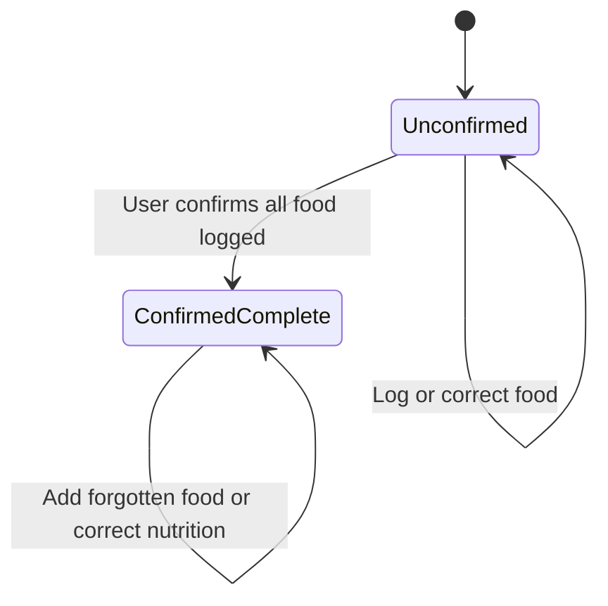
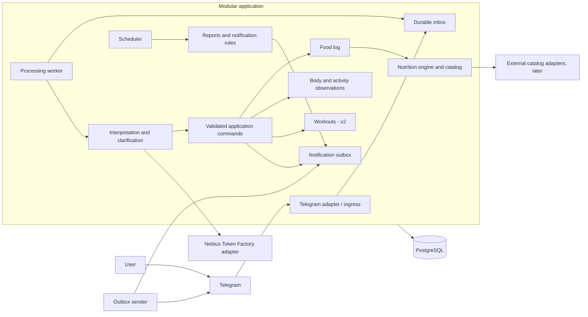

# Nutrition assistant: architecture overview

Date: 2026-09-22

Status: current design overview. Product choices and technical proposals are distinguished in the decision register. Typed contracts, M1 persistence, W002 private Telegram transport, and W003's controlled-proposal conversation worker are implemented. W004 implements the Nebius request adapter; live compatibility and model quality remain unverified. Later domains and deployment remain unimplemented; revision-specific verification belongs in the work briefs.

Input: the personal nutrition tracker architecture brief dated 2026-09-21.

## 1. Purpose and document boundaries

The product idea, v1 scope, and enduring rules are maintained in [CONSTITUTION.md](air-file://fai6b8iclscp0tss0s3r/Users/Zinaida.Smirnova/air/nutrition_assistant/CONSTITUTION.md?type=file&root=%252F). This document owns system structure, trust boundaries, data flow, reliability, and operational design; detailed behavior and persistence have their own specifications.

Milestones and progress live in [roadmap.md](air-file://fai6b8iclscp0tss0s3r/Users/Zinaida.Smirnova/air/nutrition_assistant/docs/roadmap.md?type=file&root=%252F). Consequential choices, accepted/proposed status, and the only open-question register live in [README.md](air-file://fai6b8iclscp0tss0s3r/Users/Zinaida.Smirnova/air/nutrition_assistant/docs/decisions/README.md?type=file&root=%252F). The current implementation brief is [001-persist-food-entry.md](air-file://fai6b8iclscp0tss0s3r/Users/Zinaida.Smirnova/air/nutrition_assistant/docs/work/001-persist-food-entry.md?type=file&root=%252F).

The source brief supplies historical context; later accepted decisions supersede its save-on-close and broader v1 assumptions. Existing Open WebUI deployment configuration is context, not a constraint on the new application.

## 2. Accepted decision: continuous saving and optional completion

Saving data, estimating its accuracy, and knowing whether a log is complete are three different concerns.

**Accepted:** save accepted food entries immediately. Provide an optional “Everything logged” action and recognize “close the day” as the equivalent conversational intent. Neither action saves previously unsaved entries or prevents future edits. An accepted close-day message suppresses the completion button for that date.

| Concern | Proposed behavior |
| --- | --- |
| Persistence | Store the incoming message durably; commit accepted domain changes before claiming that an entry is logged. |
| Unresolved interpretation | Store a pending clarification, with no speculative mutation of the food log. |
| Nutrition accuracy | Mark each applicable value as sourced or estimated; retain assumptions, ranges, and unknown values. |
| Completeness | A day starts unconfirmed; the user can attest that all consumed food has been logged. |
| History | Every accepted entry is immediately visible in history, including unconfirmed days. |
| Reports | Show recorded intake for all logged days. Restrict complete-day averages to confirmed days and display the denominator and exclusions. |
| Missing day | Absence of entries means missing data, not zero intake. A zero-intake day requires an explicit statement. |
| Late changes | Accept additions, corrections, and deletions with an audit trail; never silently freeze a day. |

Completeness transitions (late additions preserve completion):

The user has explicitly chosen to keep a day complete when adding forgotten food. New entries and numerical corrections revise totals without requiring closure again or another automatic check-in. Proposed consistent defaults also preserve existing completeness after deletion/date corrections, but moving food onto another date does not confirm that destination. Proposed closure default: new completion confirmations require unresolved food candidates to be clarified first. An already completed day with a pending food question retains its complete flag while reports label the unresolved data separately; resolving the question does not require re-closing. Do not add a persistent “reopened” state without a separate workflow need.

Automatic midnight closure is not used: a time boundary cannot establish logging completeness. A natural-language closure and a button press invoke the same domain command, so notification behavior does not depend on which interface was used.

A complete-day average describes only those selected days. Do not present it as a representative whole-week average when other days are missing or unconfirmed.

### Check-in boundary

The accepted product choice and its rationale are recorded in [0001-continuous-food-saving.md](air-file://fai6b8iclscp0tss0s3r/Users/Zinaida.Smirnova/air/nutrition_assistant/docs/decisions/0001-continuous-food-saving.md?type=file&root=%252F). The full dinner/21:00 interaction and proposed delivery defaults now live in section 9 of [conversation-contract-v1.md](air-file://fai6b8iclscp0tss0s3r/Users/Zinaida.Smirnova/air/nutrition_assistant/docs/conversation-contract-v1.md?type=file&root=%252F). Notification state is separate from food completeness; both trigger paths share one logical daily offer.

## 3. Interpretation boundary

Treat message text and model output as untrusted proposals. The backend supplies authenticated identity, scoped reference candidates, source timestamps/local dates, pending context, and catalog versions. It validates and resolves the proposal before producing an application command.

A message may yield independent operations and pending questions. Persist operation identity and dependency state so a delayed answer cannot replay a committed item. Pending conversation state must not hold a database transaction or block unrelated user input. Dates are resolved from the originating context rather than eventual processing time.

[conversation-contract-v1.md](air-file://fai6b8iclscp0tss0s3r/Users/Zinaida.Smirnova/air/nutrition_assistant/docs/conversation-contract-v1.md?type=file&root=%252F) owns detailed add/correct/clarify, recipe, observation, and check-in behavior. [typed-contracts-v1.md](air-file://fai6b8iclscp0tss0s3r/Users/Zinaida.Smirnova/air/nutrition_assistant/docs/typed-contracts-v1.md?type=file&root=%252F) owns the executable boundary guide. Full conversational corrections are in M2; M1 accepts an already resolved food command. Telegram message edits require explicit revision handling before being enabled; transport message deletion is not a domain delete command.

## 4. System boundary and target processes

One repository, one modular Python application, one PostgreSQL database. M1 provides persistence services; W002 adds private Telegram transport. W003 connects a controlled parser interface and bounded single-food resolver through durable jobs. The diagram shows the target runtime, including future live interpretation and background scheduling; it is not a diagram of currently running services. No microservices or Redis are needed for the initial design.

Module responsibilities:

| Module | Owns |
| --- | --- |
| Identity and settings | Internal users, Telegram identity, access policy, language, time zone, notification preferences. |
| Conversation | Raw updates, interpretation attempts, relevant context, pending clarifications and target resolution. |
| Food log | Consumed entries, logical identities, revisions, meal grouping, optional completeness. |
| Nutrition and catalog | Product and recipe versions, source selection, units, arithmetic, uncertainty and provenance. |
| Observations | Daily weight and steps in v1; other measurements, cycle observations, and activity records are future scope. |
| Workouts (v2) | Sessions, exercises and sets; incremental persistence and session completion. |
| Reporting | Derived totals, coverage, weight trends, report snapshots and scheduled notifications. |
| Infrastructure | Database access, durable jobs, provider adapters, telemetry and transport. |

Python/PostgreSQL with SQLAlchemy Core, psycopg, and Alembic is the accepted and implemented M1 stack; D003 records its pinned versions. D007 selects the implemented private long-polling transport. D009 records the user's Nebius Token Factory cloud-provider choice and secret delivery through NEBIUS_API_KEY; the exact model remains configurable and awaits evaluation. W004 implements the explicit Nebius adapter, synthetic smoke command, bounded failures, and worker integration; live model compatibility and Russian quality evaluation remain open. FastAPI is useful if later selecting webhooks and HTTP operational endpoints; it is not a mandatory second business layer.

## 5. Persistence, concurrency, and revisions

W002 uses D007's private account mappings and durable polling cursor. A per-bot PostgreSQL advisory lock prevents competing pollers from acknowledging an in-flight batch. Inbox writes commit before the next offset; no transaction spans the network wait. The separate sender claims only its bot's responses, records successful Telegram message IDs, defers explicit rate limits, and preserves ambiguous sends as uncertain. Transport does not parse incoming text into food. Live operation and provider/data policies remain separate from synthetic verification.

Accepted continuous-persistence semantics are recorded in D001. The accepted M1 relational revision decision is [0003-relational-storage.md](air-file://fai6b8iclscp0tss0s3r/Users/Zinaida.Smirnova/air/nutrition_assistant/docs/decisions/0003-relational-storage.md?type=file&root=%252F): keep current pointers and ordinary immutable revisions without requiring full event replay.

W003's D011 adds per-inbox conversation jobs, database-clock leases, frozen owned catalog context, and atomic proposal/command preparation. Short user-row locks fence state changes; parser work runs outside transactions. Restart recovery reuses M1's prepared command and outbox. Unsupported or unresolved inputs remain durable and inspectable. W004 adds the explicit Nebius adapter with generated-schema requests, local validation, terminal provider failures and durable Retry-After handling (D012). Protocol checks use injected responses; live compatibility and the full conversational workflow remain separate verification/work.

Immutability applies to ordinary editing. Explicit account erasure and agreed retention rules may purge personal revisions and source data; an audit trail is not an exception to deletion policy.

The accepted M1 execution decision is [0002-command-execution.md](air-file://fai6b8iclscp0tss0s3r/Users/Zinaida.Smirnova/air/nutrition_assistant/docs/decisions/0002-command-execution.md?type=file&root=%252F): first authenticate and commit an inbox record; acknowledge receipt only after durable acceptance. Process LLM work outside long-running database transactions. Commit the validated domain mutation, revision, processing outcome, and response outbox record in one short transaction.

- Deduplicate transport deliveries by bot identity plus Telegram update ID. A Telegram message identity includes its chat; message edits are new source revisions, not duplicate additions.
- Assign each validated operation a stable key derived from its inbox item and operation position. Reprocessing must return the prior outcome rather than apply another mutation.
- Deduplicate scheduled runs using user, notification rule, and scheduled occurrence. Deduplicate notification creation separately from delivery.
- The dinner-triggered and 21:00 fallback completion offers additionally share a single `(user_id, local_date, daily_check_in)` identity. Track offered/delivered/dismissed/suppressed state separately from food completeness. Completing the day through either interface suppresses the completion action.
- M1 serializes short mutations with a PostgreSQL user-row lock and revalidates explicit dates, quantity bases, and pinned immutable references. Fully resolved additions commute across context revisions; state-dependent corrections require their own expected-version handling in M2. The earlier user-processing lease/fencing proposal is not implemented or needed for this synchronous slice.
- A clarification waiting for the user must not hold a database lock or block that user's entire inbox. A later answer revalidates its target versions before application.
- Do not deduplicate distinct user messages only because their text matches: two identical coffees can represent two actual servings. Offer undo for accidental repeated user submissions.
- Separate retries for provider calls, command application, and message delivery. Use bounded retries and visible failed/pending states; never report an unsuccessful write as saved.
- An outbox prevents lost response intent, but cannot by itself guarantee exactly-once delivery through an external messaging service. Resolve ambiguous sends conservatively; guarantee that duplicate replies cannot duplicate food entries.

## 6. V1 database model

Step 1 is documented in [data-model-v1.md](air-file://fai6b8iclscp0tss0s3r/Users/Zinaida.Smirnova/air/nutrition_assistant/docs/data-model-v1.md?type=file&root=%252F): concrete table/column proposals, an ER diagram, keys and ownership constraints, versioning, transaction boundaries, indexes, and scenario walkthroughs. It describes the full logical model; its M1 subsection identifies the now-implemented physical subset. Step 2's interaction decisions are in [conversation-contract-v1.md](air-file://fai6b8iclscp0tss0s3r/Users/Zinaida.Smirnova/air/nutrition_assistant/docs/conversation-contract-v1.md?type=file&root=%252F); its implemented Pydantic/JSON Schema contracts and examples are indexed in [typed-contracts-v1.md](air-file://fai6b8iclscp0tss0s3r/Users/Zinaida.Smirnova/air/nutrition_assistant/docs/typed-contracts-v1.md?type=file&root=%252F). M1 migrations and command handlers now exist; later domain tables remain unimplemented.

The model separates consumed entries and revisions; products and nutrition versions; recipes with original ingredient amounts/instructions and per-100-g nutrition; eaten grams on food entries; pending clarifications; one daily weight and one daily step total; completeness confirmations and notification delivery. Training and other unconfirmed observation categories have no v1 tables.

User ownership applies to all personal records and child records, including products, recipes, interpretations, revisions, aliases, and pending actions. Shared reference data is explicitly distinguished from private data. Use ownership-preserving foreign keys and scoped queries; add PostgreSQL row-level security with a runtime role that cannot bypass it before multi-user access.

Pin each food revision to immutable nutrition or recipe versions and retain the calculated result, units, weight basis, assumptions, and source metadata. An explicit per-component source variant distinguishes catalog product, recipe, and standalone estimate. Updating a recipe must not change yesterday's meal automatically.

Keep gross weight, inedible weight, and edible weight separately and validate their relationship. Apply nutrition values to the appropriate raw/cooked and edible weight basis. Preserve unknown nutrients as NULL. Totals with unknown components must indicate partial coverage rather than display an apparently complete zero-filled sum. Use decimal arithmetic and a defined rounding policy; round for presentation after aggregation.

Store central estimates and lower/upper bounds where available, along with their reason. Aggregated bounds are working bounds, not statistical confidence intervals. Numeric confidence from an LLM is not an accuracy guarantee.

Daily totals are derived views initially. Later caches and generated reports carry the source revision or watermark used to build them. Corrections refresh live queries and invalidate cached results. A previously delivered weekly report remains a dated snapshot; a newly requested report uses current data.

## 7. Command and event contract direction

Separate untrusted parser proposals from trusted application commands. The backend supplies user identity and authoritative entity IDs; the model cannot choose authorization scope.

Every parser response needs a schema version, one or more discriminated intents, extracted quantities and units, date expressions, reference candidates, assumptions, and unresolved questions. Reject unknown fields and invalid enum values. A question such as “can I eat pizza?” produces no consumption command.

Initial command families:

- `AddConsumedFood`, `CorrectFoodEntry`, `DeleteFoodEntry`, `GetDaySummary`.
- `ConfirmDayComplete`, shared by the completion button and natural-language closure; `DismissDailyCheckIn` for “Later”.
- `SetDailyWeight`, `SetDailySteps`, `IncrementDailySteps`.
- `DefineProduct`, `ReviseProduct`, `DefineAlias` with explicit confirmation.
- V1 recipes: `DefineRecipe`, `ReviseRecipe`, and `GetRecipe`, preserving original ingredient amounts/instructions and per-100-g nutrition. A clarification/calculation workflow supplies validated recipe data; consuming a recipe uses `AddConsumedFood` with a recipe-version reference and eaten grams. No stored preparation entity is required.
- V2: `StartWorkout`, `RecordExerciseSets`, `FinishWorkout`. Other typed observations are deferred pending release scope.

Trusted mutation envelopes include an actor, operation ID, source update, effective date, resolved target, and expected target revision where applicable. Conceptual domain events include `FoodEntryAdded`, `FoodEntryRevised`, `FoodEntryDeleted`, `DayCompletenessChanged`, and `ObservationRecorded`; event metadata carries IDs and revisions rather than raw health text into logs.

The parser, command, and outcome boundaries now have strict Pydantic models, generated JSON Schema, and 20 authored Russian-language examples. The conceptual events listed above are not an implemented event-contract package. JSON shape compliance is only the first check; scoped-context and cross-field validators add checks, while future backend resolution must still verify units, ownership, references, intent, and domain rules against actual state. The examples have not been evaluated with a live model.

## 8. Recipes, future workouts, and import boundaries

Accepted recipe model after clarification: save original ingredient amounts and cooking instructions when supplied, along with name, versioned kcal/protein/fat/carbohydrate values per 100 g, and provenance. Calculate nutrition from arbitrary supplied ingredient quantities. If all ingredients can be normalized to mass and no loss-sensitive cooking assumption is present, the backend may use the conditional `ingredient_sum_no_evaporation` yield; otherwise ask for a usable finished edible weight or an explicitly approved estimate. Preserve the original amounts for cooking again; do not rescale the saved ingredient list to a 100 g recipe. Provenance retains the finished-weight basis used in the calculation. There are no default portion sizes, serving counts, or separate cooked-batch records. A food entry stores eaten grams and scales the chosen immutable recipe version by `grams / 100`. Saving a recipe does not log consumption, and updating it does not silently recalculate historical meals.

For v2, persist workout sets as they arrive. `FinishWorkout` has a useful domain meaning: it groups a completed session and can trigger its summary. It must not be required to save sets. Proposed states are `in_progress -> completed`, with `in_progress -> abandoned` and an explicit resume operation when needed. Corrections to completed sets create revisions; inactivity alone does not establish session completion.

An external importer will submit versioned domain DTOs through application services using an external namespace, record ID, revision, effective date/time-zone context, ownership mapping, and provenance. Imports use stable idempotency keys, support validation/dry runs and per-record errors, and obey the same calculation and revision invariants. Do not design legacy mappings, inspect an old database, or introduce legacy fields during this phase.

A future Apple Health connector uses an activity-source adapter and those same validation/ownership boundaries, whether its transport is MCP or something else. Provider availability, supported measurements, permissions, and sync behavior require a separate integration investigation; no working MCP connection is assumed. Preserve manual-versus-imported provenance and external record identity, and decide source reconciliation before enabling synchronization. In particular, do not add an imported daily step total on top of a manual total. Manual reminders may be suppressed only when the relevant day's data has actually been received and accepted, not merely because an account is connected. Connector implementation is outside v1.

## 9. Privacy, deployment, and operations

Private-chat-only access and an allowlisted Telegram account are proposed for the personal release. Resolve internal identity from authenticated transport data; never from model output. Validate webhook authenticity if webhooks are selected. A bot token is a secret, not an application user credential.

| Threat or failure | Proposed control |
| --- | --- |
| Another account reads or changes personal data | Allowlist initially; scoped authorization and cross-user negative tests; ownership constraints and RLS before multi-user release. |
| User text or catalog text manipulates the model | Treat content as untrusted input; bounded context and schema validation; no direct model database credentials or arbitrary tools. |
| Health data appears in logs or error reports | Log identifiers and error categories by default; redact payloads from traces and error monitoring. |
| LLM provider receives unnecessary context | Send the minimum relevant message and candidate context; avoid forwarding full history or unrelated observations. |
| Crash or retry loses or duplicates a meal | Durable inbox, operation keys, short transactions, revisions, outbox, and restart tests. |
| Data loss or account deletion is incomplete | Backups and restore rehearsal; export/delete workflow covering derived data and a documented backup-expiry policy. |

Proposed telemetry: update accepted/deduplicated; processing started/failed; parser contract rejected; clarification requested/resolved; command applied/rejected; revision conflict; calculation/source failure; scheduled run created; outbox retry/sent/uncertain; backlog age and provider latency/cost. Operational telemetry contains no food text or body measurements by default.

Retention and provider-data policies are unresolved under Q10 in [README.md](air-file://fai6b8iclscp0tss0s3r/Users/Zinaida.Smirnova/air/nutrition_assistant/docs/decisions/README.md?type=file&root=%252F); do not silently turn an earlier candidate retention duration into implemented policy. Local synthetic-data development can proceed while real-data requirements are settled.

The existing deployment settings allow zero running machines. Reminder delivery needs either a running worker or an external wake-up mechanism; an in-process timer cannot run while its process is stopped. Hosting, region, budget, and availability choices are tracked under Q11. Verify current vendor contracts before selecting or deploying the new runtime.

## 10. Delivery and verification references

The maintained roadmap is [roadmap.md](air-file://fai6b8iclscp0tss0s3r/Users/Zinaida.Smirnova/air/nutrition_assistant/docs/roadmap.md?type=file&root=%252F); the current implementation slice is [001-persist-food-entry.md](air-file://fai6b8iclscp0tss0s3r/Users/Zinaida.Smirnova/air/nutrition_assistant/docs/work/001-persist-food-entry.md?type=file&root=%252F). Do not maintain another milestone status table here.

The original 27 behavioral scenarios are preserved in [scenarios-v1.md](air-file://fai6b8iclscp0tss0s3r/Users/Zinaida.Smirnova/air/nutrition_assistant/docs/qa/scenarios-v1.md?type=file&root=%252F). QA expectations and evidence rules are in [strategy.md](air-file://fai6b8iclscp0tss0s3r/Users/Zinaida.Smirnova/air/nutrition_assistant/docs/qa/strategy.md?type=file&root=%252F). Current contract checks are not proof that those flows execute through a database, live parser, or Telegram.

Open choices and their blocking milestones are maintained in [README.md](air-file://fai6b8iclscp0tss0s3r/Users/Zinaida.Smirnova/air/nutrition_assistant/docs/decisions/README.md?type=file&root=%252F). The workflow and document-maintenance responsibilities are defined in [development-process.md](air-file://fai6b8iclscp0tss0s3r/Users/Zinaida.Smirnova/air/nutrition_assistant/docs/development-process.md?type=file&root=%252F) and [AGENTS.md](air-file://fai6b8iclscp0tss0s3r/Users/Zinaida.Smirnova/air/nutrition_assistant/AGENTS.md?type=file&root=%252F).
