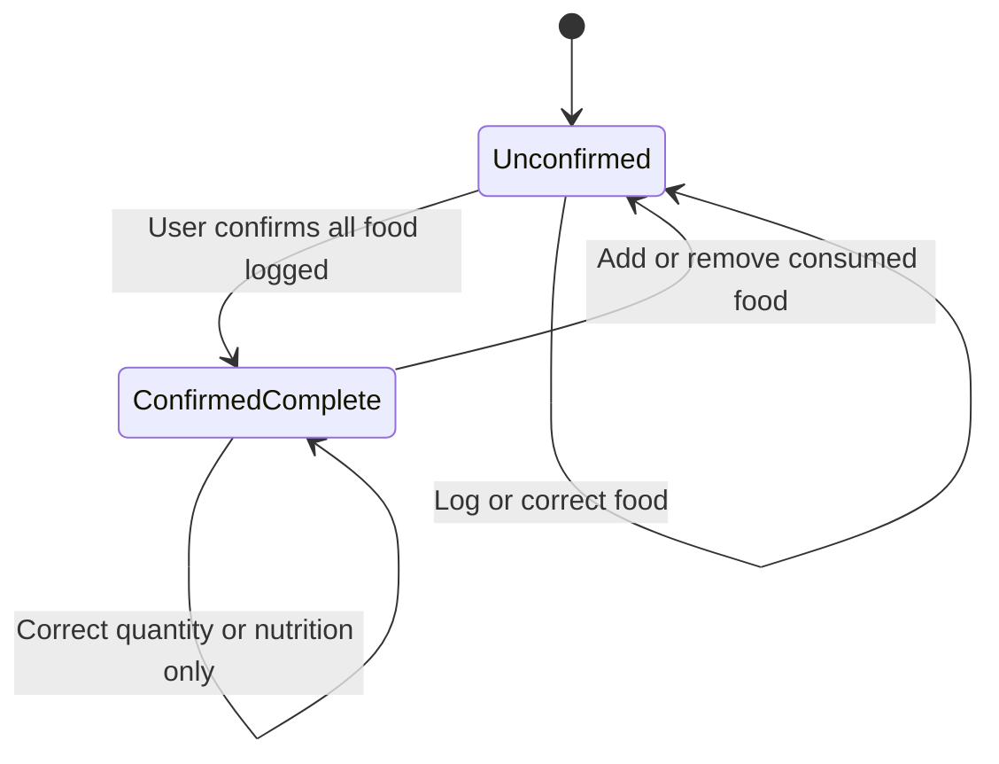
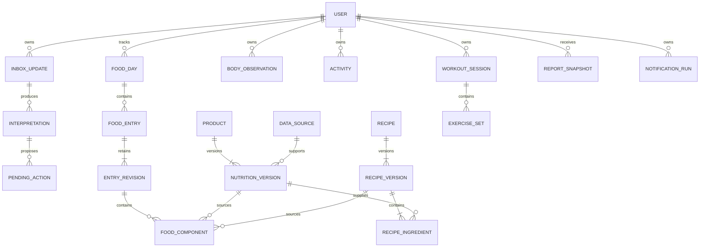

# Nutrition assistant: architecture discussion and action plan

Date: 2026-09-22

Status: working proposal; product choices below await discussion.

Input: the personal nutrition tracker architecture brief dated 2026-09-21.

## 1. Outcome and scope

Build a personal Telegram assistant that records consumed food, accepts later corrections, and provides traceable nutrition estimates. Preserve a path to multiple users through explicit ownership and isolation from the beginning.

The brief remains the target scope. The proposed first usable milestone is narrower: food logging, personal products, corrections, weight, steps, and reporting. Recipes, detailed workouts, other measurements, and menstrual-cycle context follow in independent slices unless the product owner prioritizes them earlier.

Repository inspection found deployment configuration for Open WebUI, but no application implementation. Treat that deployment as context, not a constraint on the new domain or stack. Do not change or deploy it during architecture discussion.

## 2. Decision to discuss first: what does “close day” mean?

Saving data, estimating its accuracy, and knowing whether a log is complete are three different concerns.

**Recommendation:** save accepted food entries immediately. Replace mandatory closure with an optional “Everything logged” action if complete-day statistics are useful. Keep “close day” as a conversational alias if desired. Neither action saves previously unsaved entries or prevents future edits.

| Concern | Proposed behavior |
| --- | --- |
| Persistence | Store the incoming message durably; commit accepted domain changes before claiming that an entry is logged. |
| Unresolved interpretation | Store a pending clarification, with no speculative mutation of the food log. |
| Nutrition accuracy | Mark each applicable value as sourced or estimated; retain assumptions, ranges, and unknown values. |
| Completeness | A day starts unconfirmed; the user can attest that all consumed food has been logged. |
| History | Every accepted entry is immediately visible in history, including unconfirmed days. |
| Reports | Show recorded intake for all logged days. If using complete-day averages, restrict them to confirmed days and display the denominator and exclusions. |
| Missing day | Absence of entries means missing data, not zero intake. A zero-intake day requires an explicit statement. |
| Late changes | Accept additions, corrections, and deletions with an audit trail; never silently freeze a day. |

Proposed completeness transitions:

This is a proposed default, not an approved replacement for the brief's draft/closed semantics. A completeness confirmation requires no unresolved food candidates for that date. Numeric corrections revise totals without asserting that another meal existed; additions or removals request a new completeness confirmation. Do not add a persistent “reopened” state unless a real workflow requires it.

Alternative: remove completeness entirely. Then every summary must be explicitly about recorded intake, and the app cannot identify reliably complete days. Automatic midnight closure would only establish a time boundary; it cannot establish logging completeness.

A complete-day average describes only those selected days. Do not present it as a representative whole-week average when other days are missing or unconfirmed.

## 3. Conversation and interpretation rules

- Process messages into explicit intents: consumed food, correction, deletion, query, plan, observation, workout action, or clarification response. A food mention alone is not evidence of consumption.
- A message can describe several items or actions. Validate a mutation batch before applying it. If one food batch needs clarification, keep that batch pending and make its status clear; other independent user messages can still be processed.
- Use Telegram replies and backend-provided candidate references to resolve “that chicken.” Do not let the model invent authoritative database IDs or choose another user's records.
- Default dates use the user's configured time zone and the source message time, not the eventual processing time. Preserve the UTC timestamp, effective local date, and time-zone context. Honor explicit “yesterday” and allow backdating; clarify when the intended date is materially ambiguous.
- Proposed uncertainty policy: use confirmed personal defaults first; otherwise permit a clearly stated, reasonable estimate. Ask when competing portions, products, dates, or correction targets would materially change the action. Model confidence alone is insufficient.
- An unknown “coffee as usual” requires a one-time definition. Saving an estimate must not silently create a permanent personal default.
- Replies explain what changed and offer an easy correction or undo. A pending message is described as pending, not logged.
- Explicit corrections and reply-to-entry edits are in the first milestone. Telegram message edits require separate revision handling before being enabled; deleting a Telegram message is not a supported way to delete a domain record.
- Weight is a timestamped observation. Steps default to a daily cumulative count: “8,200 steps today” replaces the current total with a revision, whereas “another 500 steps” increments only when explicitly stated. Do not conflate those commands.

## 4. Proposed system boundary

One repository, one modular application, one PostgreSQL database. API and background processing may run as separate processes built from the same application. No microservices or Redis are needed for the initial design.

Module responsibilities:

| Module | Owns |
| --- | --- |
| Identity and settings | Internal users, Telegram identity, access policy, language, time zone, notification preferences. |
| Conversation | Raw updates, interpretation attempts, relevant context, pending clarifications and target resolution. |
| Food log | Consumed entries, logical identities, revisions, meal grouping, optional completeness. |
| Nutrition and catalog | Product and recipe versions, source selection, units, arithmetic, uncertainty and provenance. |
| Observations | Weight, steps, typed measurements, cycle observations and other activity records. |
| Workouts | Sessions, exercises and sets; incremental persistence and session completion. |
| Reporting | Derived totals, coverage, weight trends, report snapshots and scheduled notifications. |
| Infrastructure | Database access, durable jobs, provider adapters, telemetry and transport. |

Use the brief's Python/PostgreSQL stack as a candidate, not a finalized dependency list. Pin library versions and verify provider contracts during implementation preparation. FastAPI is useful if selecting webhooks and HTTP operational endpoints; it is not a mandatory second business layer. Decide polling versus webhooks with hosting requirements rather than embedding transport assumptions in the domain.

## 5. Persistence, concurrency, and revisions

**Proposed ADR A — continuous persistence:** application state is durable immediately. Completion is metadata used by reports, not permission to persist.

**Proposed ADR B — ordinary relational state with revisions:** keep a current version pointer and immutable entity revisions. Read current state normally; retain prior revisions for correction history. Do not require full event sourcing or replay of every chat to reconstruct state.

Immutability applies to ordinary editing. Explicit account erasure and agreed retention rules may purge personal revisions and source data; an audit trail is not an exception to deletion policy.

**Proposed ADR C — durable asynchronous processing:** first authenticate and commit an inbox record; acknowledge receipt only after durable acceptance. Process LLM work outside long-running database transactions. Commit the validated domain mutation, revision, processing outcome, and response outbox record in one short transaction.

- Deduplicate transport deliveries by bot identity plus Telegram update ID. A Telegram message identity includes its chat; message edits are new source revisions, not duplicate additions.
- Assign each validated operation a stable key derived from its inbox item and operation position. Reprocessing must return the prior outcome rather than apply another mutation.
- Deduplicate scheduled runs using user, notification rule, and scheduled occurrence. Deduplicate notification creation separately from delivery.
- Serialize mutation processing per user with a renewable durable lease and fencing/version checks. A lease expiry or worker restart must not allow a stale interpretation to overwrite newer state. Re-read and re-resolve if the expected context revision changed.
- A clarification waiting for the user must not hold a database lock or block that user's entire inbox. A later answer revalidates its target versions before application.
- Do not deduplicate distinct user messages only because their text matches: two identical coffees can represent two actual servings. Offer undo for accidental repeated user submissions.
- Separate retries for provider calls, command application, and message delivery. Use bounded retries and visible failed/pending states; never report an unsuccessful write as saved.
- An outbox prevents lost response intent, but cannot by itself guarantee exactly-once delivery through an external messaging service. Resolve ambiguous sends conservatively; guarantee that duplicate replies cannot duplicate food entries.

## 6. Data model direction

The following is a conceptual ER model. Final columns, indexes, composite foreign keys, and migration DDL are a next architecture deliverable.

User ownership applies to all personal records and child records, including products, recipes, interpretations, revisions, aliases, and pending actions. Shared reference data is explicitly distinguished from private data. Use ownership-preserving foreign keys and scoped queries; add PostgreSQL row-level security with a runtime role that cannot bypass it before multi-user access.

Pin each food revision to immutable nutrition or recipe versions and retain the calculated result, units, weight basis, assumptions, and source metadata. An explicit per-component source variant distinguishes catalog product, recipe, and standalone estimate. Updating a recipe must not change yesterday's meal automatically.

Keep gross weight, inedible weight, and edible weight separately and validate their relationship. Apply nutrition values to the appropriate raw/cooked and edible weight basis. Preserve unknown nutrients as NULL. Totals with unknown components must indicate partial coverage rather than display an apparently complete zero-filled sum. Use decimal arithmetic and a defined rounding policy; round for presentation after aggregation.

Store central estimates and lower/upper bounds where available, along with their reason. Aggregated bounds are working bounds, not statistical confidence intervals. Numeric confidence from an LLM is not an accuracy guarantee.

Daily totals are derived views initially. Later caches and generated reports carry the source revision or watermark used to build them. Corrections refresh live queries and invalidate cached results. A previously delivered weekly report remains a dated snapshot; a newly requested report uses current data.

## 7. Command and event contract direction

Separate untrusted parser proposals from trusted application commands. The backend supplies user identity and authoritative entity IDs; the model cannot choose authorization scope.

Every parser response needs a schema version, one or more discriminated intents, extracted quantities and units, date expressions, reference candidates, assumptions, and unresolved questions. Reject unknown fields and invalid enum values. A question such as “can I eat pizza?” produces no consumption command.

Initial command families:

- `AddConsumedFood`, `CorrectFoodEntry`, `DeleteFoodEntry`, `GetDaySummary`.
- `ConfirmDayComplete` only if the completeness option is selected.
- `RecordWeight`, `SetDailySteps`, `IncrementDailySteps`.
- `DefineProduct`, `ReviseProduct`, `DefineAlias` with explicit confirmation.
- Later: `DefineRecipe`, `StartWorkout`, `RecordExerciseSets`, `FinishWorkout`, typed observations.

Trusted mutation envelopes include an actor, operation ID, source update, effective date, resolved target, and expected target revision where applicable. Domain events include `FoodEntryAdded`, `FoodEntryRevised`, `FoodEntryDeleted`, `DayCompletenessChanged`, and `ObservationRecorded`; event metadata carries IDs and revisions rather than raw health text into logs.

Before implementation, formalize this contract as Pydantic models/JSON Schema and validate it against real Russian examples. JSON shape compliance is only the first check; backend validation must also verify units, ownership, references, intent, and plausible ranges.

## 8. Workouts and import boundary

Persist workout sets as they arrive. `FinishWorkout` has a useful domain meaning: it groups a completed session and can trigger its summary. It must not be required to save sets. Proposed states are `in_progress -> completed`, with `in_progress -> abandoned` and an explicit resume operation when needed. Corrections to completed sets create revisions; inactivity alone does not establish session completion.

An external importer will submit versioned domain DTOs through application services using an external namespace, record ID, revision, effective date/time-zone context, ownership mapping, and provenance. Imports use stable idempotency keys, support validation/dry runs and per-record errors, and obey the same calculation and revision invariants. Do not design legacy mappings, inspect an old database, or introduce legacy fields during this phase.

## 9. Privacy, deployment, and operations

Private-chat-only access and an allowlisted Telegram account are proposed for the personal release. Resolve internal identity from authenticated transport data; never from model output. Validate webhook authenticity if webhooks are selected. A bot token is a secret, not an application user credential.

| Threat or failure | Proposed control |
| --- | --- |
| Another account reads or changes personal data | Allowlist initially; scoped authorization and cross-user negative tests; ownership constraints and RLS before multi-user release. |
| User text or catalog text manipulates the model | Treat content as untrusted input; bounded context and schema validation; no direct model database credentials or arbitrary tools. |
| Health data appears in logs or error reports | Log identifiers and error categories by default; redact payloads from traces and error monitoring. |
| LLM provider receives unnecessary context | Send the minimum relevant message and candidate context; avoid forwarding full history or unrelated observations. |
| Crash or retry loses or duplicates a meal | Durable inbox, operation keys, short transactions, revisions, outbox, and restart tests. |
| Data loss or account deletion is incomplete | Backups and restore rehearsal; export/delete workflow covering derived data and a documented backup-expiry policy. |

Proposed telemetry: update accepted/deduplicated; processing started/failed; parser contract rejected; clarification requested/resolved; command applied/rejected; revision conflict; calculation/source failure; scheduled run created; outbox retry/sent/uncertain; backlog age and provider latency/cost. Operational telemetry contains no food text or body measurements by default.

Retention is a product decision still pending: raw messages, model request/response bodies, normalized revisions, and backups need separate durations. Proposal for discussion: retain necessary source text and normalized revisions for the user's history; retain verbose model payloads only briefly, with a candidate 30-day limit. No secondary analytics or training use by default. Agree this before storing real health data; do not silently implement the candidate limit.

The existing deployment settings allow zero running machines. A reminder design must therefore explicitly provide either a running worker or an external scheduled wake-up mechanism; an in-process timer cannot run while its process is stopped. Hosting, database region, provider processing regions, availability, and budget remain to be decided. Do not assume a configured app region determines every service's data residency. Current vendor API/deployment details still require verification; web documentation lookup was unavailable during this discussion.

## 10. Action plan and acceptance criteria

| Stage | Concrete work | Exit criteria |
| --- | --- | --- |
| 0. Product decisions | Resolve completeness, estimation behavior, and first-release scope. Write explicit examples for dates, corrections, and steps. | Each decision is recorded as accepted, rejected, or deferred; reports cannot confuse missing data with zero intake. |
| 1. Architecture contracts | Finalize C4/container boundaries, ER model, parser/command schemas, state machines, and ADRs for persistence, history, concurrency, and versioning. Agree privacy and hosting before real-data deployment. | Contracts cover the scenario set; no unresolved product choice blocks the first vertical slice. |
| 2. First food slice | Establish migrations, identity, durable inbox, seeded personal products, deterministic calculation, explicit food commands, persistence, and reply delivery. | One meal survives restart; the reply matches persisted state; duplicate transport delivery produces one meal; cross-user access is rejected. |
| 3. Conversational corrections | Add Russian-language parsing behind an adapter, pending clarifications, reference resolution, correction/delete/undo, and a small annotated evaluation set. | “Another 80 g” and “80 g instead” have different correct effects; bones revise edible weight; stale and ambiguous targets cannot silently change records; plans create no meals. |
| 4. Daily use | Add weight, daily steps, completeness if selected, on-demand history and weekly report, export/delete, and one deployed personal environment. | Backdated records use the intended day; repeated step totals replace rather than double; reports show coverage; export and deletion behave as documented; restore rehearsal passes. |
| 5. Scheduled use | Add configurable evening checks, weekly schedule, and durable notification runs. | Reminders survive restarts, honor local time and daylight-saving transitions, avoid duplicate run creation, and support disabling. No auto-confirmation of completeness. |
| 6. Domain expansion | Add recipes with finished yield, workouts/sets, measurements, cycle context, and activity according to priority. | Recipe revisions preserve history; sets survive interrupted sessions; sensitive observations stay isolated and out of unrelated prompts. |
| 7. Convenience and future users | Confirmed aliases, habit suggestions, optional external catalogs/barcodes, and a multi-user readiness review. | Suggestions never silently change defaults; model/prompt releases pass regression evaluation; isolation and deletion tests pass before inviting other users. |

Stages 2 and 3 should be built around one complete scenario, not separate infrastructure projects. Do not add a catalog integration before local products and manual label values work. Decide whether simple saved meal combinations belong in the first milestone after seeing actual “usual meal” examples.

## 11. Initial scenario set

1. “2 eggs, 43 g bread, coffee as usual”: resolve known defaults; clarify an unknown coffee alias.
2. “Add another 80 g of pâté to lunch”: add an actual portion once, including after transport retries.
3. “It was 80 g, not 100”: revise the referenced entry; ambiguous targets prompt a question.
4. “The chicken included 33 g of bones”: preserve gross weight and revise edible weight and totals.
5. “Maybe pizza tonight”: no consumed-food entry.
6. “Yesterday I also ate an apple”: backdate it, update history and relevant report calculations, and apply the chosen completeness policy.
7. “8,200 steps today”, then “9,000 steps today”: final daily total is 9,000.
8. Only breakfast logged: history contains breakfast; the weekly report does not call it confirmed full-day intake.
9. Provider timeout, then worker restart: retain the pending message and apply any eventual mutation once.
10. One known nutrient and one unknown component: show a partial total rather than invent missing values.
11. Product or recipe update: previously logged food retains the version used at the time.
12. A correction arrives while another is being parsed: version checks prevent stale overwrites.
13. A user attempts to reference another user's entry: authorization rejects the command.
14. A reminder is scheduled across a daylight-saving change: create one intended occurrence in the user's local time.

## 12. Discussion queue

First round: optional completeness versus no confirmation; estimation versus clarification; first usable release scope.

Second round, before deployment: hosting/budget and regional constraints; allowed LLM data sharing; raw-message/model-payload retention; export/deletion expectations; whether the existing reminder times are still wanted.

Can be decided without blocking the first slice: calendar-day attribution with explicit backdating; immediate revision-based corrections; manual labels before barcode integration; personal defaults only after confirmation; no autonomous code changes; no legacy migration work yet.

Do not treat unanswered questions as accepted requirements. This document is an architecture proposal and implementation sequence, not authorization to deploy or a claim that implementation is complete.
