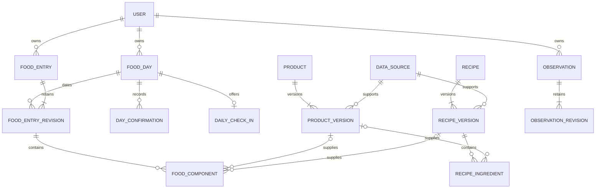

# V1 database model

Status: step 1 proposal revised after product review. Food revisions, pending clarification rules, recipe ingredients/instructions with per-100-g nutrition, one weight/steps value per day, and late-addition completeness are accepted; remaining implementation details are proposals. Typed contracts, M1 migrations, resolved product-food handlers, and PostgreSQL integration checks now exist. The full model below still includes later unimplemented domains; section 13 identifies the physical subset.

Scope: food, products, recipes, weight, daily steps, clarifications, and the accepted combined check-in. Training tables are excluded from v1. Additional activity fields remain undecided. This document refines the architecture plan; it does not mark all technical choices as product-approved.

Document ownership: [CONSTITUTION.md](air-file://fai6b8iclscp0tss0s3r/Users/Zinaida.Smirnova/air/nutrition_assistant/CONSTITUTION.md?type=file&root=%252F) owns enduring requirements; [README.md](air-file://fai6b8iclscp0tss0s3r/Users/Zinaida.Smirnova/air/nutrition_assistant/docs/decisions/README.md?type=file&root=%252F) owns acceptance status and open questions. D002/D003 record the accepted M1 storage/execution choices; D006 records its numeric policy. This file owns the detailed logical schema and constraints.

## 1. Main design decisions

1. Store accepted food immediately. Food completeness, nutrition uncertainty, and message-processing status are separate facts.
2. Give each consumed entry a stable identity and immutable revisions. Read its current revision for totals; keep earlier revisions for explanation and undo.
3. Store recipes with original ingredient amounts, optional cooking instructions, and versioned kcal/protein/fat/carbohydrate values per 100 g. Store the amount eaten on a consumed-food entry. No default recipe portion, serving count, or separate cooked-batch entity is needed. Preserve the finished weight used for calculation as provenance rather than a portion definition.
4. Keep pending questions outside consumed-food tables. A durable message is not automatically a consumed meal.
5. Keep one revisable body-weight value and one revisable step total per user/local date. Later values replace the current daily value while preserving revision history.
6. Enforce user ownership through every relationship, including catalog data and revisions. Start with private products; shared external catalogs remain adapters rather than shared mutable user rows.

## 2. Conventions and common fields

Tables below list domain columns; all user-owned tables additionally have `id uuid`, `user_id uuid`, and `created_at timestamptz`. Exceptions are explicitly identified. IDs are assigned by the backend, not the LLM. Operational rows may also have `updated_at`.

| Concern | Concrete storage rule |
| --- | --- |
| Tenant identity | `users.id` is the root. Personal tables expose `UNIQUE (user_id, id)`. References to personal rows include both `user_id` and the referenced ID. |
| Entity identity | A logical entity has a stable ID and a `current_revision_id` or `current_version_id` pointing to its current immutable snapshot. |
| Revision identity | Each revision has its own UUID, a parent ID, `revision_no integer > 0`, `applied_operation_id`, and optional `change_reason text`. `UNIQUE (user_id, parent_id, revision_no)` prevents duplicate revision numbers. |
| Current pointers | A composite foreign key must prove that a current revision belongs to that entity and user. Use deferred foreign-key checking when creating the entity and its first revision in one transaction. |
| Authorship | `applied_operations` records who caused the change and which input/clarification supports it. Catalog versions use the same provenance convention. |
| Quantities | PostgreSQL `numeric(18,6)` for physical quantities and nutrition values; `bigint` for external integer identifiers and counters. Observation values use numeric with an integer constraint for steps. Decimal arithmetic is used before storage; presentation rounding is separate. |
| Dates | Store UTC instants as `timestamptz`, user-assigned `date`, and an IANA time-zone name as `text` where date attribution matters. A later settings change does not reassign historical dates. |
| Missing values | Use NULL for an unknown nutrient or measurement attribute. No observation means no supplied measurement; explicit zero steps is valid. |
| Enumeration | Constrained text for domain statuses, units, meal types, and metric types. Versioned parser schemas use the same allowed values. |
| JSON | Use `jsonb` for versioned parser output, pending proposals, source evidence, rendered report snapshots, and transport payloads. Keep authoritative quantities, ownership, states, dates, and queryable references in typed columns. |
| Erasure | Revisions are immutable during ordinary use. Account erasure and retention cleanup may purge personal snapshots and payloads under the agreed policy. |

For each foreign key below, include the tenant key even when abbreviated in the table. A UUID alone is not an authorization boundary. All reads are user-scoped; use ownership-preserving foreign keys and add RLS before multi-user release. The runtime database role must not bypass RLS when that protection is enabled.

## 3. Core ER model

This diagram covers domain relationships. Operational messaging tables are described separately to keep the diagram readable. Capitals correspond to the plural table names below.

The optional component-source relationships are alternatives: a component references exactly one product version, recipe nutrition version, or approved standalone estimate source. These are not three quantities to add together.

## 4. Identity, input, and processing

| Table | Important columns beyond common fields | Keys and rules |
| --- | --- | --- |
| `users` | `id`, `created_at`, `time_zone`, `language`, `status` | Root row, so no `user_id`. Begin with Europe/Berlin and Russian as configured defaults. |
| `telegram_accounts` | `bot_id bigint`, `telegram_user_id bigint`, `private_chat_id bigint`, `status` | Unique `(bot_id, telegram_user_id)` and `(bot_id, private_chat_id)` for the personal/private-chat model. Resolve identity from transport, never parsed text. |
| `inbox_updates` | `telegram_account_id`, `telegram_update_id bigint`, `telegram_chat_id bigint`, `telegram_message_id bigint NULL`, `reply_to_message_id bigint NULL`, `source_sent_at`, `received_at`, `update_kind`, `payload jsonb NULL`, `processing_status`, `attempt_count`, `next_attempt_at`, `error_code NULL` | Store authenticated/authorized input durably. M1 additionally stores `bot_id`; unique `(bot_id, telegram_update_id)` deduplicates bot-wide deliveries, with a composite account/user/bot foreign key. Enforce that the account and stored chat belong to the same user. Message identity includes account and chat; multiple updates can refer to one edited message. |
| `interpretations` | `inbox_update_id`, `attempt_no`, `provider`, `model_version`, `prompt_version`, `schema_version`, `context_revision`, `output jsonb NULL`, `validation_status`, `error_code NULL` | Unique `(user_id, inbox_update_id, attempt_no)`. Record failed attempts without treating them as commands. Payload retention may differ from minimal processing metadata. |
| `pending_actions` | `origin_interpretation_id`, `schema_version`, `proposal jsonb`, `effective_local_date NULL`, `question_code`, `state`, `revision_no`, `resolved_operation_id NULL` | States `waiting`, `resolved`, `cancelled`. Backend-validated candidate IDs and expected target revisions are carried in the versioned proposal and revalidated before application. This is untrusted staging, not a query source for totals. |
| `pending_action_inputs` | `pending_action_id`, `inbox_update_id`, `sequence_no` | Retain the original input and clarification replies, including several rounds. Unique `(user_id, pending_action_id, inbox_update_id)` and ordered sequence per action. |
| `applied_operations` | `operation_key text`, `command_kind`, `actor_kind`, `inbox_update_id NULL`, `pending_action_id NULL`, `applied_at` | Unique `(user_id, operation_key)`. The key is the backend-assigned command operation UUID, persisted before execution in the interpretation/action mapping. Insert this applied row only with the committed mutation. Repeated operations return their existing outcomes. |
| `user_processing_leases` (future proposal; not M1) | `user_id`, `owner_token`, `fencing_no bigint`, `lease_until` | One row per user; `user_id` is the primary key, with no separate ID. Prevent stale workers from committing after lease loss. Not held while waiting for a user answer. |

Inbox processing states are `received`, `processing`, `waiting_for_user`, `applied`, `ignored`, and `failed`. A terminal `ignored` result covers questions or plans with no mutation. Accepted mixed-message behavior: commit independently clear items while unclear items wait for clarification. A message can therefore be `waiting_for_user` with some linked operations already applied. No unresolved item enters food totals, and answering a pending item cannot reapply completed items.

An update ID deduplicates delivery, not user intent. Two separately sent “usual coffee” messages can represent two servings. Do not impose a uniqueness constraint on message text.

For every entity revision, `applied_operation_id` identifies its source operation. For a clarification-driven operation, the linked pending action and its input rows preserve the full chain of messages. Read the affected revisions to recover the result of a retried operation; the typed command/result contracts define the required payloads and evidence links.

## 5. Food days, consumed entries, and completeness

| Table | Important columns | Keys and rules |
| --- | --- | --- |
| `food_days` | `local_date`, `time_zone_at_creation`, `data_revision bigint`, `entry_set_revision bigint`, `completeness_state` (`unconfirmed` or `complete`), `latest_confirmation_id NULL` | Unique `(user_id, local_date)`. `data_revision` changes with any food mutation. `entry_set_revision` changes when consumed entries are added, deleted, or moved across dates. A complete day requires a confirmation reference; no persisted daily nutrient totals. |
| `day_confirmations` | `food_day_id`, `entry_set_revision`, `intake_declaration` (`logged_food` or `explicit_zero_food`), `method` (`message` or `button`), `applied_operation_id`, `confirmed_at` | Immutable evidence that the user declared the log complete. Each operation creates at most one confirmation. The day pointer must reference its own user's confirmation. Keep earlier confirmations after later edits. An empty log requires an explicit zero-food confirmation rather than inferring zero from a bare close-day request. |
| `food_entries` | `current_revision_id` | Stable identity of one consumed portion or dish. No mutable quantity, nutrient totals, or duplicated meal description on this header. |
| `food_entry_revisions` | `food_entry_id`, `revision_no`, `food_day_id`, `meal_type`, `consumed_at NULL`, `description`, `state` (`active` or `deleted`), `applied_operation_id`, `change_reason NULL` | A revision is a complete snapshot. Date corrections can point a new revision to another food day. Prior revisions retain the old date. Meals are a constrained attribute in v1, not a separate session lifecycle. |
| `food_components` | `food_entry_revision_id`, `position`, `description`, source fields and quantities below, nutrition snapshot, `calculation_version` | Unique `(user_id, food_entry_revision_id, position)`. Components are immutable children of one revision. A simple item has one component; an estimated composite dish may have several. Deleted revisions have no contributing components. |

Component source fields:

- `source_kind`: `product`, `recipe`, or `approved_estimate`.
- `product_version_id NULL`, `recipe_version_id NULL`, `estimate_source_id NULL`: exactly the matching one is non-NULL.
- An estimate source must retain the user-approved assumptions; an LLM proposal alone cannot authorize an estimated portion.
- `reported_quantity numeric`, `reported_unit text`, `weight_basis` (such as raw/cooked), `gross_g NULL`, `inedible_g NULL`, `edible_g NULL`, and `volume_ml NULL`. Recipe consumption requires the eaten edible weight in grams; the recipe itself has no portion-size field.
- Quantities are positive except inedible weight, which may be zero. Where gross and inedible weights are both supplied, edible weight equals their difference and must be positive for an active portion. Missing inedible weight is not automatically a known zero.
- Preserve reported units, and calculate from a compatible normalized quantity. Use a confirmed product conversion for pieces, density, or raw-to-cooked changes; otherwise ask. For a recipe described as “one bowl,” ask how many grams were eaten. Do not assume 1 ml equals 1 g.

Reading current food joins `food_entries.current_revision_id` to active revisions, then to their components. Old revisions, tombstones, pending actions, and saved recipe profiles never contribute directly to intake totals. Creating a recipe is not evidence that any food was eaten.

For an edit, create a new entry revision with complete component snapshots and move the pointer in the same transaction. Undo creates another revision copying the selected earlier state; it does not erase history. Editing one component must not drop or duplicate the unaffected components.

### Accepted late-addition policy and proposed edge cases

Accepted in this discussion: adding a forgotten snack to a closed day keeps it complete. The backend revises entries and totals without requiring another closure. Numerical corrections likewise preserve completion. `entry_set_revision` captures what existed at confirmation time for audit; matching it to the current revision is not a condition of completeness.

Proposed consistent defaults: deletion and date corrections also preserve any existing confirmation. Moving food to an unconfirmed destination day does not automatically confirm that destination. A completed day with no current entries and no explicit zero-food declaration is reported as empty/unknown intake, not included as a zero in averages. An explicit zero-food declaration ceases to describe zero intake once active food is added, even though the historical declaration remains in the audit trail.

Pending clarification is independent of completeness. If an unresolved food action concerns a completed day, retain its complete flag and display the outstanding question; temporarily exclude that day from complete-and-resolved intake averages. When the action is resolved or cancelled, eligibility returns without a new closure. Unknown-date pending food actions must be clarified before accepting a new closure, rather than guessed onto a date. Report the count of completed days separately from the count usable for a particular nutrient average.

Notification suppression is separate: the existence of a prior confirmation records that the user already closed that date. Later food changes must not automatically send a second combined check-in. Removing data for privacy is a separate erasure operation, not an ordinary food deletion.

## 6. Products and nutrition facts

| Table | Important columns | Keys and rules |
| --- | --- | --- |
| `data_sources` | `kind`, `provider_name NULL`, `external_reference NULL`, `captured_at`, `evidence jsonb NULL`, `origin_update_id NULL`, `confirmation_operation_id NULL` | Immutable provenance snapshots: confirmed personal data, label/manufacturer, branded catalog, generic database, recipe calculation, or approved estimate. User-owned in v1. Do not mutate a source snapshot that supports historical food. |
| `products` | `current_version_id`, `archived_at NULL` | Stable identity. Archiving removes an option from new selections without breaking existing references. |
| `product_versions` | `product_id`, `version_no`, `name`, `brand NULL`, `data_source_id`, `nutrition_basis` (`per_100_g` or `per_100_ml`), nutrition values, `grams_per_piece NULL`, `ml_per_piece NULL`, `density_g_per_ml NULL`, `weight_basis`, `applied_operation_id` | Unique `(user_id, product_id, version_no)`. Conversions are user-confirmed/source-backed, not invented. Name and label data are versioned for historical explanation. |

Nutrition values are a defined column family, repeated in immutable product versions, recipe versions, and consumed-component snapshots:

- `kcal`, `protein_g`, `fat_g`, `carbs_g`: each `numeric(18,6) NULL`.
- For each nutrient, optional `<name>_lower` and `<name>_upper`, with both present or both absent; if present, `0 <= lower <= value <= upper`.
- `quality`: `sourced`, `estimated`, or `mixed`; `uncertainty_reason NULL`; optional descriptive `confidence` with no claim of calibrated probability.
- Every known central value is nonnegative. If the central value is NULL, its bounds are NULL. Do not derive missing fat/carbohydrates from total calories or replace unknown nutrients with zero.

The table determines the basis: product values are per 100 g/ml, recipe values are always per 100 g, and component values are for the consumed quantity. Do not sum numbers across these bases directly.

Source selection follows the brief's precedence, checking that product and basis actually match. A directly supplied matching label replaces a generic estimate through an explicit new version. Changing `products.current_version_id` affects new selections only; historical components continue to point at the version used for them.

A future name-alias table may map a confirmed phrase to a versioned product or recipe. An alias must not introduce a hidden stored recipe portion or a second nutrition store; consumed grams still belong to the food entry.

## 7. Recipes: per-100-g nutrition and consumed food

| Table | Important columns | Keys and rules |
| --- | --- | --- |
| `recipes` | `current_version_id`, `archived_at NULL` | Stable identity of a named reusable recipe. |
| `recipe_versions` | `recipe_id`, `version_no`, `name`, `cooking_instructions NULL`, `nutrition_origin` (`provided` or `calculated`), `data_source_id`, per-100-g nutrition values and uncertainty, `calculation_yield_g NULL`, `yield_basis NULL`, `calculation_version NULL`, `applied_operation_id` | Unique `(user_id, recipe_id, version_no)`. Nutrition basis is fixed to per 100 g. A calculated profile requires a positive finished-weight basis and calculation version. That weight describes calculation provenance, never a default portion. No prepared-batch identity or serving-count fields. |
| `recipe_ingredients` | `recipe_version_id`, `position`, `name_as_entered`, `original_quantity`, `original_unit`, `weight_basis`, `product_version_id NULL`, `calculation_quantity NULL`, `calculation_unit NULL` | Unique position within a version. Preserve the user's initial amounts, not amounts rescaled to a 100 g recipe. Pin resolved ingredient nutrition versions. A nullable product reference allows preserving an unresolved named ingredient; calculation requires its source to be resolved or explicitly marked unknown, never treated as zero. |

Accepted storage policy after the conversation clarification: save recipe name, original ingredient amounts, cooking instructions when supplied, kcal/protein/fat/carbohydrate values per 100 g, provenance, and revision metadata. The exact provenance columns above are design proposals. Food entries store consumed grams and the resulting nutrient snapshot. For each known nutrient, `consumed_value = value_per_100_g * eaten_grams / 100`.

Example: saved soup contains 70 kcal, 4 g protein, 2 g fat, and 9 g carbohydrates per 100 g. Eating 250 g creates one food entry with 175 kcal, 10 g protein, 5 g fat, and 22.5 g carbohydrates. The recipe remains a per-100-g profile with no portion size. Supplied label calories are not recomputed from macro energy factors.

Creating or changing a recipe does not create consumed food. New entries select the current recipe version; old entries retain their original version and values. Correcting nutrition for an already logged meal must explicitly include that food entry in the operation.

Accepted recipe workflow: accept arbitrary ingredient amounts, ask for needed quantities/sources or finished edible weight, and calculate kcal/macros per 100 g deterministically. For each nutrient, sum the ingredient contributions and divide by the finished edible weight, then multiply by 100. Original ingredient quantities and optional instructions remain available for cooking the recipe again. Directly supplied per-100-g values remain a supported input; do not require invented ingredients for such a profile.

Do not assume a cooked dish weighs the sum of its raw ingredients. Ask for a usable finished-weight basis when needed; an uncertain yield or ingredient estimate requires explicit user approval and visible uncertainty. Unknown ingredient nutrients propagate to unknown recipe nutrients. If the user supplies instructions, preserve them as recipe content, not as instructions to the assistant or execution engine. None of this requires a stored serving size or cooked-batch record.

## 8. Weight and daily steps

| Table | Important columns | Keys and rules |
| --- | --- | --- |
| `observations` | `metric` (`weight` or `daily_steps`), `series_date date NOT NULL`, `current_revision_id` | Both metrics require a unique `(user_id, metric, series_date)` slot, including after a prior deletion. At most one current weight and one current step total per day. No averaging of multiple body-weight values within a day. |
| `observation_revisions` | `observation_id`, `revision_no`, `metric`, `value numeric NULL`, `unit`, `observed_at NULL`, `local_date`, `time_zone`, `state` (`active` or `deleted`), `origin_kind`, `applied_operation_id` | Parent and revision metric must match through an ownership-preserving relationship, and revision date must match the parent's series date for both metrics. For active weight: value > 0 and unit kg. For active steps: nonnegative integer and unit steps. Deleted revisions have NULL value and are omitted from current views. |

The generic observation shape has only two allowed v1 metrics. Do not silently add training, cycle observations, or extra activity fields through arbitrary JSON. Later metrics need explicit validation and product scope.

“8,200 steps today” then “9,000 steps today” creates two revisions of one observation. “Weight 76.3 today” then “Weight 76.1 today” similarly leaves one current value of 76.1 kg for that date, retaining 76.3 only in revision history. A repeated identical set-value message is a no-op, not another measurement. “Another 500 steps” increments the current total only after validating the explicit increment intent; it requires a known starting total or clarification.

Correcting either measurement onto a different date uses the two daily slots in one operation, resolving any existing target value rather than blindly replacing or adding it. Undo and deletion are revision-based. Future import adapters must reconcile imported measurements with manual records; they must not create extra daily weight values or a separate series added to the manual steps.

## 9. Check-ins, scheduled notifications, and report snapshots

| Table | Important columns | Keys and rules |
| --- | --- | --- |
| `daily_check_ins` | `food_day_id`, `trigger_kind` (`dinner` or `fallback`), `offer_status`, `offered_at NULL`, `dismissed_at NULL`, `telegram_message_id NULL` | Unique `(user_id, food_day_id)`. The day itself is unique by local date. Track offer delivery separately from food completeness and missing activity. |
| `notification_rules` | `kind`, `enabled`, `local_time`, `weekday NULL`, `version_no` | Configure the 21:00 fallback and optional weekly report. Unique `(user_id, kind)` in v1. Use the user's configured time zone to resolve due occurrences. |
| `notification_runs` | `rule_id`, `rule_version_no`, `occurrence_key`, `scheduled_for_utc`, `subject_local_date`, `status`, `daily_check_in_id NULL`, `report_snapshot_id NULL` | Unique `(user_id, rule_id, occurrence_key)`. An occurrence key represents the intended local-date/period occurrence, not a worker attempt. Do not include the rule version in uniqueness in a way that resends the same daily offer after an edit. |
| `outbox_messages` | `message_key`, `telegram_account_id`, `subject_local_date NULL`, `inbox_update_id NULL`, `pending_action_id NULL`, `daily_check_in_id NULL`, `notification_run_id NULL`, `applied_operation_id NULL`, `payload jsonb`, `status`, `attempt_count`, `next_attempt_at`, `telegram_message_id NULL` | Unique `(user_id, message_key)`. Supports clarification questions, ordinary replies, and scheduled messages. A dinner acknowledgment containing a check-in is one outgoing message, not an acknowledgment plus a separate repeated offer. |
| `report_snapshots` | `period_start`, `period_end`, `generated_at`, `report_rules_version`, `source_watermarks jsonb`, `payload jsonb` | Immutable derived report, not canonical food data. Period end is exclusive. Watermarks record the food-day and observation revisions used; payload contains totals and coverage already authorized for that user. |

Create a food-day row for a fallback check-in even if no food is recorded; an empty day row is not evidence of zero food or completeness. A daily-check-in row similarly says only that an offer was planned or shown.

Offer states cover planned, sent, dismissed, and suppressed; the outbox separately records uncertain or failed deliveries. Persist a unique offer before sending. Re-check food confirmation and missing steps immediately before generating/sending the relevant actions. Superseded offers are cancelled, and old callbacks validate current state and their bound date. Completing food may remove the completion action while preserving an activity-only action if needed.

An outbox can preserve send intent, but the external transport may leave a send outcome uncertain. Do not promise exactly-once visible messages. Ensure retries cannot duplicate domain changes, notification run creation, or logical check-ins; define ambiguous-send recovery in the transport contract.

Live day summaries are queries over current active revisions. Aggregate each nutrient independently and return known subtotal, missing-component count, and known coverage. A fully unknown nutrient yields an unknown total, not a displayed zero; a partially known subtotal is explicitly partial. With zero consumed entries, recorded intake can be displayed as empty, but must not imply a confirmed zero-intake day.

Complete-day averages show the number and dates of included days. Weight trends and step summaries have their own coverage, independent of food completeness. Previously delivered reports remain historical snapshots; new reports use current data. No daily-summary cache table is needed initially.

## 10. Constraints, transactions, and access paths

Use database constraints for row-level validity, uniqueness, revision ownership, and tenant ownership. Use application validation inside the same transaction for cross-row arithmetic, resolving references, compatible quantity conversions, closure prerequisites, and the allowed source/recipe state. Do not describe a cross-table rule as a simple CHECK constraint.

Mutation transaction outline:

1. Acquire the M1 user-row mutation lock and revalidate ownership, frozen command input, and pinned source versions. Later state-dependent commands must also check their expected entity revisions; provider-spanning processing leases remain a separate proposal.
2. Check whether the operation key was already applied.
3. Insert the operation, immutable entity revisions, and immutable component/recipe-ingredient snapshots as applicable.
4. Move current pointers using compare-and-set on expected previous pointers. Bump affected food-day revision counters. A date move touches both days.
5. Write any confirmation/check-in changes and one durable response intent.
6. Mark input processing complete and commit. Roll back the entire mutation on conflict; resolve against fresh context before retrying.

Do not call the LLM, external catalogs, or Telegram while holding this transaction. A pending question is committed as staging state and an outgoing question; it holds neither a database transaction nor a per-user lease while waiting for a reply.

Initial indexes, in addition to unique constraints:

- Inbox: `(processing_status, next_attempt_at, received_at)` for ready work and `(user_id, received_at, id)` for user ordering.
- Pending actions: `(user_id, state, effective_local_date)` and origin/input foreign keys.
- Entry revisions: `(user_id, food_day_id, food_entry_id)` plus current-pointer and component-parent indexes.
- Catalog/recipe revision parent indexes and all ownership-preserving foreign keys used by joins/deletion.
- Observations: `(user_id, metric, series_date)` and revision `(user_id, local_date, observed_at)` for date-range queries.
- Outbox: `(status, next_attempt_at, created_at)` for dispatch; check-in and notification-run references.
- Reports: `(user_id, period_start, period_end, generated_at)`.

M1 index and deferred-constraint definitions are frozen in its migrations and exercised on local PostgreSQL. Indexes/tables for pending actions, observations, recipes, and reports remain later work.

## 11. Walkthroughs to validate in implementation

| Input/scenario | Expected persistence/result |
| --- | --- |
| 100 g of a known product | One entry, one initial revision, one component pinned to a product version. |
| “Actually 80 g” | Same entry; new revision/component snapshot; totals include only 80 g. |
| A repeated Telegram delivery | Existing inbox item/operation result; no second portion or revision. |
| “A bowl of soup” with no known portion | Durable input and pending action; no consumed component until answered. |
| Known gross chicken weight; later bones weight | Revision preserves gross and inedible weights separately and recalculates edible nutrition. |
| A changed label | New product version; previous meals keep the old version and values. |
| Save a recipe's per-100-g nutrition | Recipe version saved; no eaten grams, serving, batch, or food entry is created. |
| Supply arbitrary recipe ingredients and cooking instructions | Clarify missing calculation inputs; save original amounts/instructions and derived nutrition per 100 g, without a default portion. |
| Eat 250 g of a recipe at 70 kcal per 100 g | One food entry contains 175 kcal and references the immutable recipe version. |
| Weight 76.3, then 76.1 on one day | One daily observation with two revisions; current value is 76.1 kg, not an average or a second weight entry. |
| Steps 8,200, then 9,000 | Two revisions of one daily slot; displayed total is 9,000. |
| Close food day with no steps | Confirmation stored; steps remain missing; activity-only action is allowed. |
| Add a forgotten snack after closure | New entry/revisions and revised totals; food day stays complete with no additional completion prompt. |
| Close day before fallback, or in the dinner message | No completion button is offered after successful closure. |
| Fallback at 21:00, dinner at 22:00 | One daily-check-in row and one logical offer, not a new reminder. |
| Reply to yesterday's steps prompt after midnight | Update yesterday's daily observation unless the reply explicitly specifies another date. |
| Product ID from another user appears in model output | Tenant validation/composite foreign keys reject it before mutation. |
| Process crashes before/after commit | Either no mutation or the committed mutation and response intent; retry cannot add a second meal. |

## 12. Implementation boundary and next work

This document retains the full logical model and its proposed later-domain details. M1 now implements and tests the subset identified below; this is not a claim that every table in the full model exists.

Accepted after review: food revisions; unresolved entries outside totals while clear items are saved; recipes with original ingredients, optional cooking instructions, and nutrition per 100 g without stored portions/batches; one weight and one step total per day; preservation of completeness after late additions; and replies with entry plus daily totals. Detailed edge-case defaults remain proposals; additional activity metrics remain separately undecided.

Step 2's typed parser, command, and outcome schemas, operation identity rules, and examples are documented in [typed-contracts-v1.md](air-file://fai6b8iclscp0tss0s3r/Users/Zinaida.Smirnova/air/nutrition_assistant/docs/typed-contracts-v1.md?type=file&root=%252F). M1 now persists already resolved product-food commands. Natural-language resolution and the later domain handlers remain subsequent slices. Hosting, LLM provider behavior, privacy/retention, and runtime application dependency choices remain separate decisions before real-data deployment.

The maintained implementation sequence is [roadmap.md](air-file://fai6b8iclscp0tss0s3r/Users/Zinaida.Smirnova/air/nutrition_assistant/docs/roadmap.md?type=file&root=%252F); [001-persist-food-entry.md](air-file://fai6b8iclscp0tss0s3r/Users/Zinaida.Smirnova/air/nutrition_assistant/docs/work/001-persist-food-entry.md?type=file&root=%252F) defines the minimal first migration/handler slice. Track unresolved choices in [README.md](air-file://fai6b8iclscp0tss0s3r/Users/Zinaida.Smirnova/air/nutrition_assistant/docs/decisions/README.md?type=file&root=%252F) rather than adding a separate question queue here.

## 13. Implemented M1 subset and physical differences

Runtime query definitions: [schema.py](air-file://fai6b8iclscp0tss0s3r/Users/Zinaida.Smirnova/air/nutrition_assistant/nutrition_app/schema.py?type=file&root=%252F). Frozen migrations: [0001_m1_food_persistence.py](air-file://fai6b8iclscp0tss0s3r/Users/Zinaida.Smirnova/air/nutrition_assistant/migrations/versions/0001_m1_food_persistence.py?type=file&root=%252F) and [0002_bot_delivery_identity.py](air-file://fai6b8iclscp0tss0s3r/Users/Zinaida.Smirnova/air/nutrition_assistant/migrations/versions/0002_bot_delivery_identity.py?type=file&root=%252F). The local database is PostgreSQL 17.11; validation uses separate disposable schemas.

Implemented tables: users, telegram_accounts, inbox_updates, prepared_operations, applied_operations, data_sources, products, product_versions, food_days, food_entries, food_entry_revisions, food_components, and outbox. Alembic maintains its own version table.

- Prepared operations retain an immutable typed command and request hash, one operation at position zero per M1 message. Applied operations retain the immutable result; unapplied state is the absence of that result. No whole-message completion flag falsely claims that future partial workflows are implemented.
- M1 sources are synthetic seeded products. Product versions and components store typed nutrient columns with optional bounds. Components support compatible normalized mass/volume, with pinned source/version and calculation policy. Recipe and approved-estimate components are explicitly unsupported in this handler.
- User context and food-day revision counters are present. M1 uses short user-row locks rather than a user-processing-lease table. It revalidates pinned explicit additive commands under that lock; dependent conversational operations are future work.
- Composite current-pointer foreign keys include both owner and parent identity and are deferred until commit. Ordinary snapshot updates are rejected by database triggers. Snapshot deletion/retention workflows remain a separate requirement.
- Food-day completeness fields exist so additions can preserve them; M1 has no user-facing completion command or notification/check-in tables. Pending counts are zero because pending workflows are not implemented.
- The outbox holds one committed result per operation, with pending/sending/sent/uncertain/failed states, bounded proven-unsent retries, and token/lease-guarded acknowledgments. It currently dispatches only through a fake adapter.
- Numeric behavior follows [0006-numeric-policy.md](air-file://fai6b8iclscp0tss0s3r/Users/Zinaida.Smirnova/air/nutrition_assistant/docs/decisions/0006-numeric-policy.md?type=file&root=%252F). Day queries aggregate persisted current component snapshots; partial and unknown nutrients remain distinguishable.

The integration checks in [test_food_service.py](air-file://fai6b8iclscp0tss0s3r/Users/Zinaida.Smirnova/air/nutrition_assistant/tests/integration/test_food_service.py?type=file&root=%252F) exercise constraints, migrations, failure/restart boundaries, concurrency, and ownership. No RLS policy or public transport authentication is claimed by this slice.
