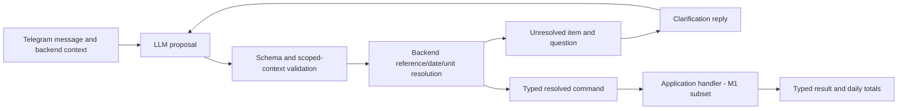

# Typed contracts v1

Status: implemented as strict Pydantic models, generated JSON Schema 2020-12, and 20 authored parser/command/result examples. M1 implements resolved product-food commands; W002 adds private Telegram transport and Russian rendering. W003 adds a controlled parser interface and bounded single-food resolver using these unchanged contracts. W004 sends this generated parser schema to the Nebius adapter and validates returned content locally. W006 executes the existing `answer_clarification` contract for one reply-linked dairy-fat question; W007 executes one clear plus one dairy-pending `add_food` pair; W009 resolves bounded correction/delete/undo proposals into W008 commands. Broader clarification/correction command families remain unimplemented and live compatibility remains unverified.

This document owns the implemented contract boundary and example guide. Product requirements are in [CONSTITUTION.md](air-file://fai6b8iclscp0tss0s3r/Users/Zinaida.Smirnova/air/nutrition_assistant/CONSTITUTION.md?type=file&root=%252F); milestone status is in [roadmap.md](air-file://fai6b8iclscp0tss0s3r/Users/Zinaida.Smirnova/air/nutrition_assistant/docs/roadmap.md?type=file&root=%252F); independent verification expectations are in [strategy.md](air-file://fai6b8iclscp0tss0s3r/Users/Zinaida.Smirnova/air/nutrition_assistant/docs/qa/strategy.md?type=file&root=%252F). The current stateful implementation is scoped by [001-persist-food-entry.md](air-file://fai6b8iclscp0tss0s3r/Users/Zinaida.Smirnova/air/nutrition_assistant/docs/work/001-persist-food-entry.md?type=file&root=%252F).

## 1. Contract artifacts

| Boundary | Python source of truth | Portable schema |
| --- | --- | --- |
| Untrusted parser output | [parser.py](air-file://fai6b8iclscp0tss0s3r/Users/Zinaida.Smirnova/air/nutrition_assistant/nutrition_contracts/parser.py?type=file&root=%252F) | [parser-output.schema.json](air-file://fai6b8iclscp0tss0s3r/Users/Zinaida.Smirnova/air/nutrition_assistant/contracts/v1/parser-output.schema.json?type=file&root=%252F) |
| Backend-resolved commands | [commands.py](air-file://fai6b8iclscp0tss0s3r/Users/Zinaida.Smirnova/air/nutrition_assistant/nutrition_contracts/commands.py?type=file&root=%252F) | [command.schema.json](air-file://fai6b8iclscp0tss0s3r/Users/Zinaida.Smirnova/air/nutrition_assistant/contracts/v1/command.schema.json?type=file&root=%252F) |
| Backend outcomes | [results.py](air-file://fai6b8iclscp0tss0s3r/Users/Zinaida.Smirnova/air/nutrition_assistant/nutrition_contracts/results.py?type=file&root=%252F) | [outcome.schema.json](air-file://fai6b8iclscp0tss0s3r/Users/Zinaida.Smirnova/air/nutrition_assistant/contracts/v1/outcome.schema.json?type=file&root=%252F) |

Shared decimal, quantity, source-reference, and nutrition types are in [common.py](air-file://fai6b8iclscp0tss0s3r/Users/Zinaida.Smirnova/air/nutrition_assistant/nutrition_contracts/common.py?type=file&root=%252F). The API validates JSON with `model_validate_json`; strict Python-object validation intentionally does not coerce string UUIDs/dates into Python objects.



## 2. Wire conventions

- Every parser output and command carries `schema_version: "1.0"`; outcomes carry the version inside `result`. Unknown versions, action kinds, and object fields are rejected.
- Decimal quantities and nutrient values are strings, e.g. `"76.1"`, `"250"`, `"0.000001"`. At most 12 integer digits and 6 fractional digits match the accepted M1 database precision in D006. Floats, exponent notation, comma decimals, whitespace, negative quantities, and non-finite values are rejected. The parser converts Russian lexical `76,1` to the canonical string `"76.1"` without arithmetic.
- Steps and counters are strict JSON integers; booleans are not counts. Zero steps is valid; zero eaten mass or a zero step increment is not.
- Unknown nutrition is `null`. A zero is a known value. Nutrient ranges have paired lower/upper bounds and a central value inside them. Supplied calories are not reconstructed from macros.
- Calculated recipes record a yield basis: `measured`, `ingredient_sum_no_evaporation`, or `user_confirmed_estimate`. The ingredient-sum basis is conditional provenance, not a serving size; it is allowed only after the backend normalizes every ingredient to an unambiguous mass.
- Dates in commands are ISO calendar dates; time zones are IANA names. The parser may retain exact source date words in `date_hint.text`, or null when none were supplied. The backend resolves them against the original source-message time, not execution time. If the source contains no date evidence, the backend uses the source message's local date and ignores any model-supplied date hint; a model cannot invent a target date.
- Parser references are opaque context tokens such as `c1`, never database IDs. Action IDs such as `a1` are local to one interpretation. Neither token is globally unique or an idempotency key.
- Optional extracted values use explicit null when missing. Missing parser values can be valid proposals; they are not permission to execute a command with unresolved quantities or targets.

## 3. Proposal to command mapping

| Parser action | Backend command or disposition |
| --- | --- |
| `add_food` | `add_consumed_food`, after resolving source, eaten amount, date, and units. |
| `correct_food` | `correct_food_entry` with stable entry ID, expected current revision, and a complete replacement snapshot. |
| `delete_food` / `undo_food` | `delete_food_entry` / `restore_food_entry`, with scoped target and revision guards. Undo creates a new revision. |
| `set_daily_weight` | `set_daily_weight`, with one target user/date slot and value in kg. |
| `set_daily_steps` / `increment_daily_steps` | Absolute set / explicit increment. Increment requires an existing revision and known starting total. |
| `define_recipe` / `revise_recipe` | Recipe definition/replacement with original ingredient quantities, optional instructions, and a provided profile or deterministic calculation inputs. |
| `define_product` / `revise_product` | Versioned product definition/replacement with source-backed supplied nutrition and a known basis. |
| `get_day_summary` / `get_recipe` | Read-only domain queries. Recipe retrieval includes original ingredient amounts and instructions. |
| `food_question` | `preview_food` when sources/amount are resolved; otherwise ask a question. Never adds consumed food. |
| `confirm_day_complete` | `confirm_day_complete` after checking pending food and empty-day declarations. Missing steps do not block it. |
| `answer_clarification` | Resolve the original pending operation; do not create another independent food command identity. |
| `cancel_clarification` | `cancel_pending_action`; leave unrelated saved items intact. |
| `non_logging` | Plan/chat/unsupported/ambiguous intent; no consumption command. A clarification can still be needed. |

`dismiss_daily_check_in` is a trusted button command. It does not need an LLM interpretation. Future aliases, additional activity metrics, training, and scheduled report generation are outside this contract package; do not bypass strict schemas to add them silently.

## 4. Partial messages, dependencies, and stable operation identity

The backend allocates an operation UUID for each persisted action before executing any of that interpretation. Store the ordered action-ID-to-operation-ID mapping; the UUID string is the proposed database's `operation_key`. The transport's unique inbox identity owns this mapping. On redelivery, reload it instead of rerunning the model and allocating fresh operations.

An `operation_id` in a command is always backend-assigned. A proposal's `a1` is only a local reference and must never be used by itself to deduplicate updates.

For “200 g soup and some bread,” commit the soup's operation and retain the bread's operation as pending. The clarification response resolves that same bread operation, adds its message to `evidence_update_ids`, and retains the original update, original date, and pending-action ID. It must not replay the soup. A question is not an applied operation; allocate its pending identity without prematurely marking a food mutation applied.

`depends_on` represents actual dependencies, not merely message order. Independent clear items can proceed. Consuming a just-defined recipe uses an `action_result` reference to its definition and a matching dependency. Validate unique action IDs, known dependencies, acyclic graphs, and correct result types before persisting/executing any part. Then freeze the interpretation graph. Retry incomplete nodes using the original IDs; do not regenerate an already partly applied graph.

The handler must also infer domain prerequisites from current state. In particular, a parser-provided empty dependency list must not let day completion run before pending food actions, or allow a dinner check-in between dinner and an explicit closure in the same message.

At command execution, `expected_revision_id: null` on a daily set means the backend expects the user/date slot to be absent. It is not permission to ignore an existing slot. A non-null expected revision must match. Unique user/metric/date constraints and compare-and-set updates are still required in PostgreSQL. Repeated identical absolute values yield `no_change`; transport retries reuse the original stored outcome, rather than creating revisions or increments again.

## 5. Recipes and corrections

A recipe's `ingredients` retain original units and amounts. Resolved ingredient sources additionally pin a product nutrition version and normalized mass/volume for calculation; these must not replace the user-facing original amounts. An explicitly unknown ingredient source propagates unknown nutrients rather than zero.

Provided recipe profiles contain per-100-g nutrition and source provenance. Calculated profiles contain ingredients, finished edible weight, yield provenance, and calculation-policy version; the command does not accept a model-computed nutrition result. The backend computes each nutrient as `ingredient_total / finished_yield_g * 100`. Its persisted recipe version and result carry those per-100-g values.

There are no recipe default-portion, serving-count, or separate batch fields. Recipe food entries require eaten grams. Optional cooking instructions remain user content and must not become executable instructions to the resolver or model orchestration.

An estimated yield requires explicit approval evidence. Membership of an approval ID in the source chain is validated here; the future backend must still verify that the referenced message actually approved the relevant estimate.

`correct_food_entry` contains a complete replacement state. The backend fills unchanged components from the current entry and recalculates from pinned sources. It must not let a terse correction erase unrelated components. Moving a meal across dates updates both day summaries even though the receipt identifies its new date. Recipe/product changes create new versions; existing meals change only when explicitly included in a correction.

## 6. What validation guarantees

| Layer | Implemented checks | Additional work required |
| --- | --- | --- |
| Portable JSON Schema | Closed objects; discriminated action types; required fields; numeric-string syntax; positive quantities; UUID/date formats when format checking is enabled. | Provider-specific structured-output support must be verified by its adapter. These schemas are not claimed to be directly supported by every LLM provider. |
| Pydantic validation | Strict wire types plus action graphs, ordered nutrient bounds, mass consistency, source-chain links, recipe prerequisites, time-zone recognition, and consistent result coverage/receipts. | These checks are not all expressible in or exported to JSON Schema. For example, JSON Schema considers `9000.0` an integer mathematically, while strict Python validation rejects that float token for steps. Portable-schema success alone is insufficient. |
| Scoped parser-context validation | Candidate existence/type, actual reply context, source-text excerpt membership, and known pending question/answer types. | Candidate ownership, units, date interpretation, user intent, source accuracy, and quoted-value fidelity still require backend resolution. A literal evidence excerpt is not proof the model interpreted it correctly. |
| Transactional application execution | M1 owned product-food writes, W002 private transport, W003 frozen single-food interpretation/command recovery, W006 one reply-linked dairy clarification, W007 one clear-plus-pending pair, W008 trusted correction/delete/restore execution, and W009 bounded conversational targets. Contracts remain unchanged. | General correction target search, multi-action execution, recipes, observations, completion, and mixed dependencies remain unimplemented. Live model/Telegram operation has not been verified. |

The candidate-token map and pending-question map are created from authenticated backend context. Never accept those maps from the model. A null or ambiguous pending target requires clarification; it is not an instruction to select the latest pending item.

Outcome schemas distinguish `applied`, `no_change`, `needs_clarification`, `rejected`, and read-only results. Applied food changes require entry summaries and updated day totals. Day nutrients distinguish complete, partial, wholly unknown, and empty coverage. Food completeness remains independent of nutrient coverage and pending clarification. User-visible rendering must use the applicable coverage, not assume every number is a full-day total.

When one message produces multiple outcomes, aggregate committed outcomes and a fresh current day query into one response. Intermediate per-operation snapshots remain audit data; do not sum daily summaries from different operations or show stale totals in the combined reply.

## 7. Concrete examples and their limits

The 20 scenario files contain source text, parser context, the expected parser output, illustrative resolved commands, and backend outcomes. UUIDs, products, and nutrition values are synthetic. Examples are expected contracts, not output captured from a live model or a running backend.

Start with:

- [01_add_food.json](air-file://fai6b8iclscp0tss0s3r/Users/Zinaida.Smirnova/air/nutrition_assistant/contracts/v1/examples/01_add_food.json?type=file&root=%252F): a known recipe and supplied eaten grams.
- [02_mixed_food.json](air-file://fai6b8iclscp0tss0s3r/Users/Zinaida.Smirnova/air/nutrition_assistant/contracts/v1/examples/02_mixed_food.json?type=file&root=%252F) and [03_clarification_after_midnight.json](air-file://fai6b8iclscp0tss0s3r/Users/Zinaida.Smirnova/air/nutrition_assistant/contracts/v1/examples/03_clarification_after_midnight.json?type=file&root=%252F): save soup now and resolve bread later using its existing operation and original date.
- [04_correct_food.json](air-file://fai6b8iclscp0tss0s3r/Users/Zinaida.Smirnova/air/nutrition_assistant/contracts/v1/examples/04_correct_food.json?type=file&root=%252F): revise the same entry from 100 g to 80 g.
- [08_recipe_needs_finished_weight.json](air-file://fai6b8iclscp0tss0s3r/Users/Zinaida.Smirnova/air/nutrition_assistant/contracts/v1/examples/08_recipe_needs_finished_weight.json?type=file&root=%252F) and [09_recipe_calculation_answer.json](air-file://fai6b8iclscp0tss0s3r/Users/Zinaida.Smirnova/air/nutrition_assistant/contracts/v1/examples/09_recipe_calculation_answer.json?type=file&root=%252F): clarify finished weight, preserve ingredient amounts/instructions, and calculate nutrition per 100 g.
- [15_late_food_unknown_nutrient.json](air-file://fai6b8iclscp0tss0s3r/Users/Zinaida.Smirnova/air/nutrition_assistant/contracts/v1/examples/15_late_food_unknown_nutrient.json?type=file&root=%252F): retain day completeness while honestly reporting a missing nutrient.

Other cases cover daily weight replacement, steps set/no-op/increment, recipe direct input, recipe-then-consumption dependencies, planned food, nutrition questions, closure without steps, pending cancellation, bones, independent weight logging during a pending food question, ambiguous correction targets, and undo.

Cases are independent unless their notes explicitly describe a continuation. The test catalog supplies example arithmetic only. The recipe example uses round-half-up at six decimal places for stored calculated values; an engine implementation must apply that policy explicitly and keep higher precision through intermediate calculations.

## 8. Reproduce validation and versioning

Dependencies are pinned in [requirements-contracts.txt](air-file://fai6b8iclscp0tss0s3r/Users/Zinaida.Smirnova/air/nutrition_assistant/requirements-contracts.txt?type=file&root=%252F). Use Python 3.12 or later; this change was verified on Python 3.14.

```sh
python3 -m venv .venv
.venv/bin/python -m pip install -r requirements-contracts.txt
.venv/bin/python -m nutrition_contracts.export
.venv/bin/python -m unittest discover -s tests -v
```

[test_contracts.py](air-file://fai6b8iclscp0tss0s3r/Users/Zinaida.Smirnova/air/nutrition_assistant/tests/test_contracts.py?type=file&root=%252F) checks schema validity/drift, all examples against both validators, scoped context references, malformed values, source/approval chains, graph constraints, revision guards, nutrient coverage, and independently calculated example arithmetic. These are contract tests; they do not measure live-model accuracy or prove database idempotency/tenant isolation.

Version 1.0 is the initial, unreleased contract. Before release it can evolve with synchronized models, exported schemas, examples, and tests. After release, changed field meanings, new required fields, renamed kinds, and new union variants require an explicitly versioned rollout; closed clients reject unknown variants. Preserve old interpretation/command versions for audit and handle supported versions deliberately rather than coercing stored payloads into the latest schema.

## 9. Implemented M1 application boundary

[service.py](air-file://fai6b8iclscp0tss0s3r/Users/Zinaida.Smirnova/air/nutrition_assistant/nutrition_app/service.py?type=file&root=%252F) accepts authenticated internal actor IDs separately from the command envelope. It durably accepts a mapped source message, freezes one resolved product-food command per source, and executes it from its stored identity. A successful mutation returns OutcomeEnvelope; typed application exceptions reject unsupported/invalid/foreign input without a success response intent. Real transport rendering of failures is later work.

Only resolved add_consumed_food with pinned product components, W006 clarification, W007's bounded partial-saving pair, W008 trusted food correction/delete/restore commands, and W009's bounded reply/candidate/description target resolution are implemented. Recipe/estimate components, general multi-action clarification, broad correction targeting, observations, and completion remain contract definitions without application handlers. M1 permits compatible mass/per-100-g and volume/per-100-ml inputs only; it does not perform unstated conversions.

Operation replay returns its original persisted result, while get_day queries current state. Complete explicit additions are revalidated under a user-row lock even when their observed context revision is older; this is not permission to ignore expected revisions on future state-dependent commands. No contract schema or fixture was changed to implement this slice.

See [0002-command-execution.md](air-file://fai6b8iclscp0tss0s3r/Users/Zinaida.Smirnova/air/nutrition_assistant/docs/decisions/0002-command-execution.md?type=file&root=%252F) and [0006-numeric-policy.md](air-file://fai6b8iclscp0tss0s3r/Users/Zinaida.Smirnova/air/nutrition_assistant/docs/decisions/0006-numeric-policy.md?type=file&root=%252F) for execution and arithmetic rules, and [test_food_service.py](air-file://fai6b8iclscp0tss0s3r/Users/Zinaida.Smirnova/air/nutrition_assistant/tests/integration/test_food_service.py?type=file&root=%252F) for actual PostgreSQL evidence.
